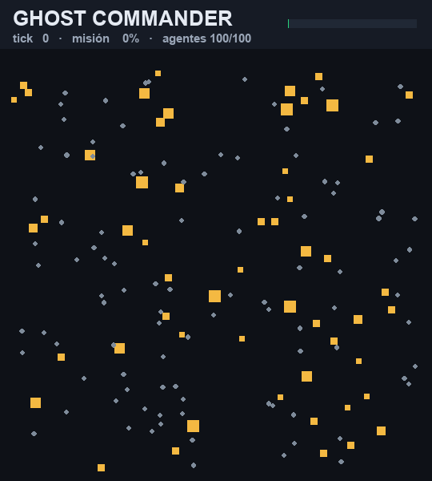

# 👻 Ghost Commander

**Un sistema capaz de coordinar cientos de agentes autónomos en entornos
cambiantes, maximizando el éxito de la misión mediante reasignación dinámica de
recursos.**

Ghost Commander no es un observador ni un paper: es un **comandante digital**.
Asigna tareas, detecta fallos y reorganiza la flota en tiempo real para que la
misión se complete a pesar de las pérdidas.

> El resultado que persigue no es *"qué arquitectura tan interesante"*, sino:
> **"Acabo de ver 100 agentes perder un tercio de sus recursos a una onda de
> choque y reorganizarse solos para completar la misión."**

<p align="center">
  
</p>

<p align="center"><em>Escenario por defecto: 100 agentes, onda de choque en el tick 18 que tumba ~40, y la flota se reorganiza sola hasta completar las 55 tareas. (Generado con <code>tools/make_demo_gif.py</code> — determinista.)</em></p>

---

## Demo en 30 segundos

```bash
# headless: una misión + comparación de las 3 estrategias
python examples/run_demo.py

# dashboard interactivo (mapa 2D, métricas, timeline, replay, comparación)
ghost-commander-app
```

Salida típica del demo (escenario por defecto, 100 agentes, onda de choque en el
tick 18 que tumba ~35% de la flota):

```
=== single run (global strategy) ===
  mission completion : 100.0%
  tasks done         : 55/55
  agents lost        : 40
  reassignments      : 18
  determinism digest : bbd2c0926212c315

=== strategy comparison (same scenario + seed) ===
  1. global   mission=100.0%  done=55/55  ticks=60   lost=40  reassign=18
  2. auction  mission=100.0%  done=55/55  ticks=64   lost=40  reassign=18
  3. greedy   mission=100.0%  done=55/55  ticks=111  lost=40  reassign=24
```

La flota pierde 40 de 100 agentes a mitad de misión y aun así la termina. El
comandante reasigna 18 veces las tareas que quedaron huérfanas. Las tres
estrategias completan, pero `greedy` tarda casi el doble y necesita más
reasignaciones: la comparación hace visible *por qué* la coordinación importa.

---

## Tu propio caso

El dashboard es un **coordinador genérico**: no usa datos reales, pero cualquier
situación de *N unidades que atienden M puntos* se modela. En la pestaña
**✏️ Tu caso** describes la hipótesis en una frase — *"6 drones que entregan a 30
hospitales, urgente y con fallos"* — y un parser local la traduce a un escenario
(unidades, puntos, plazos, fallos, onda de choque, llegadas), que puedes ajustar
a mano y ejecutar. Luego lo ves en **🛰 Misión** y pruebas las estrategias en **📊**.

## Demo en vivo

**▶ [ghost-commander.streamlit.app](https://ghost-commander-2payzpkpventdr3jqx95bg.streamlit.app/)**

Toca los 9 escenarios, cambia la estrategia y arrastra el replay para ver cómo
la flota se reorganiza tras la onda de choque. Todo determinista: misma seed +
escenario + estrategia ⇒ misma misión.

<details><summary>Cómo se despliega (Streamlit Community Cloud)</summary>

El repo incluye `streamlit_app.py` (entry point), `requirements.txt` y
`.streamlit/config.toml`. En [share.streamlit.io](https://share.streamlit.io):
New app → repo `JFHelvetius/ghost-commander`, branch `main`, archivo
`streamlit_app.py`. Auto-redespliega en cada push a `main`.
</details>

## Instalación

```bash
python -m venv .venv
.venv/Scripts/activate          # Windows
pip install -e ".[app,dev]"     # app = dashboard, dev = tests
```

Requiere Python ≥ 3.11. El núcleo solo depende de `numpy`; el dashboard añade
`streamlit`, `plotly` y `pandas`.

---

## Uso (CLI)

```bash
ghost-commander presets                              # escenarios y estrategias
ghost-commander run --strategy global --seed 7       # una misión
ghost-commander run --preset swarm --save run.json   # 200 agentes, guarda replay
ghost-commander compare --preset scarce              # ranking de estrategias
```

Escenarios incluidos: `default`, `swarm` (200 agentes), `scarce` (recursos
escasos), `calm` (sin fallos), `contested` (con deadlines, la misión se puede
*perder*), `rush` (plazos muy ajustados, escaparate del triage), `streaming`
(entorno cambiante: tareas que llegan en oleadas), `specialist` (flota
heterogénea con un especialista escaso), `endurance` (desgaste largo con bases
de recarga), `joint` (tareas cooperativas que exigen equipos). Estrategias:
`greedy`, `auction`, `global`, `triage` (deadline-aware), `optimal` (óptimo
exacto por tick, baseline).

### Cuándo la coordinación *gana o pierde* la misión

En `default` sobran agentes incluso tras el shock, así que las tres estrategias
completan (la diferencia es de **velocidad**). El escenario `contested` añade
**deadlines de tarea**: una tarea que no se completa a tiempo **fracasa** — una
pérdida de misión. Con una flota más justa bajo desgaste continuo, la calidad de
la coordinación se vuelve **éxito**, no solo velocidad:

```
ghost-commander compare --preset contested
rank strategy  mission   done     failed  ticks   lost   reassign
------------------------------------------------------------------
1    auction   98.5%     58/60    2       95      35     32
2    global    96.3%     56/60    4       136     39     35
3    greedy    88.8%     53/60    7       131     37     33
```

`greedy` pierde 7 tareas (es local y por orden de llegada: se amontona y
reorganiza tarde); las estrategias que resuelven la contención globalmente
(`auction`, `global`) salvan bastante más. **El hallazgo robusto across seeds es
que `greedy` sacrifica más tareas bajo presión de deadline**; quién gana entre
`auction` y `global` cambia según la misión. La métrica de misión está
**ponderada por prioridad**, así que perder una tarea VITAL pesa más que perder
una LOW.

### Cuando los plazos aprietan: triage deadline-aware

Las cuatro estrategias anteriores pesan prioridad contra distancia pero **ignoran
el tiempo**. La estrategia `triage` estima si un agente *aún llega* a una tarea
antes de su deadline (`tiempo_viaje + tiempo_trabajo` vs `slack`): descarta las
causas perdidas y se lanza a las tareas salvables y urgentes, las críticas
primero. Con plazos holgados se comporta como `global`; cuando aprietan, gana:

```
ghost-commander compare --preset rush
rank strategy  mission   done     failed  ticks   lost   reassign
------------------------------------------------------------------
1    triage    88.3%     48/60    12      80      28     23
2    global    84.1%     44/60    16      80      28     23
3    auction   79.3%     43/60    17      80      28     24
4    greedy    69.0%     37/60    23      80      28     28
```

`triage` salva **11 tareas más que `greedy`** en la misma misión. Across seeds es
el ganador medio cuando los deadlines son ajustados; con deadlines desactivados
produce exactamente la misma misión que `global` (mismo digest determinista).

### Entornos cambiantes: tareas que llegan durante la misión

El comandante no siempre conoce todos los objetivos de antemano. El preset
`streaming` arranca con solo 20 tareas y deja que **otras 60 lleguen en oleadas**
durante la misión, cada una con su propio deadline. El mundo crece de 20 a 80
tareas mientras los agentes ya están en movimiento: no se puede planificar una
vez, hay que **reorganizarse continuamente**.

```
ghost-commander compare --preset streaming
rank strategy  mission   done     failed  ticks   lost   reassign
------------------------------------------------------------------
1    triage    100.0%    80/80    0       178     39     12
2    auction   100.0%    80/80    0       181     42     15
3    global    100.0%    80/80    0       181     42     15
4    greedy    76.2%     62/80    18      204     54     33
```

Las estrategias coordinadas absorben las oleadas y completan; `greedy` no sigue
el ritmo y pierde 18 tareas. `triage` es además la más **eficiente** (12
reasignaciones y 39 agentes perdidos, frente a 33/54 de greedy).

### Agentes heterogéneos: enrutar al tipo correcto

Hasta aquí cualquier agente servía para cualquier tarea. El preset `specialist`
da a cada agente **una especialidad** (`recon`, `repair`, `medical`) y a cada
tarea un **skill requerido**: una tarea de reparación solo la trabaja un técnico.
Y los técnicos son **escasos** (20% de la flota) frente a una demanda de
reparación pareja → un cuello de botella. Ya no basta con mandar al más cercano:
hay que enrutar al *tipo* correcto y triagear a los especialistas escasos.

```
ghost-commander compare --preset specialist
rank strategy  mission   done     failed  ticks   lost   reassign
------------------------------------------------------------------
1    triage    84.2%     47/60    13      111     32     25
2    auction   82.9%     46/60    14      112     32     23
3    global    81.5%     44/60    16      107     32     23
4    greedy    78.1%     42/60    18      112     32     25
```

La restricción de especialidad se respeta siempre (un agente nunca trabaja una
tarea de skill ajeno). Bajo el cuello de los especialistas escasos, `triage` es
el ganador **medio** across seeds (gana 4 de 6); `greedy` gestiona peor la flota.
La especialización es **opt-in**: sin `agent_skills`, la flota es homogénea y los
escenarios anteriores conservan su digest determinista exacto.

### Recuperación: bases de recarga y sostenimiento de la flota

En misiones largas de desgaste, los agentes se agotan y mueren. El preset
`endurance` añade **bases de recarga**: un agente que baja del umbral se retira
de su tarea (que vuelve al pool), va a la base más cercana, reposta y regresa.
La recuperación convierte la atrición en un problema de logística que el
comandante gestiona. El valor se ve aislando la palanca — mismo escenario, misma
estrategia, con y sin bases:

```
endurance · triage      misión    tareas    flota viva
-----------------------------------------------------------
sin bases               41%       21/70     0/40   (la flota se extingue)
con 4 bases             91%       56/70     5/40   (125 viajes de recarga)
```

**La recuperación convierte una catástrofe del 41% en un 91%.** Pero no es
gratis y el proyecto es honesto al respecto: bajo *deadlines muy ajustados*, el
tiempo de ir a repostar puede costar más puntualidad de la que ahorra — recargar
es una decisión con coste, no un free lunch. La recuperación es **opt-in**
(`n_bases=0` la desactiva sin tocar los digests existentes).

### Tareas cooperativas: coordinación *entre* agentes

Hasta aquí cada tarea la hacía un agente. El preset `joint` hace que ~40% de las
tareas necesiten un **equipo de 2 agentes presentes a la vez**: el progreso solo
ocurre cuando el equipo completo está en el sitio. Ahora el comandante no solo
asigna singletons, debe **sincronizar llegadas** — un agente que llega antes
espera (y gasta recursos), y una tarea de equipo se **estanca** si pierde a uno
de los suyos. Es coordinación entre agentes, no solo asignación.

```
ghost-commander compare --preset joint
rank strategy  mission   done     failed  ticks   lost   reassign
------------------------------------------------------------------
1    global    100.0%    50/50    0       78      37     25
2    triage    100.0%    50/50    0       80      37     26
3    auction   100.0%    50/50    0       97      38     27
4    greedy     88.5%    43/50    7       97      40     33
```

Las estrategias que reparten globalmente forman equipos y completan las 19
tareas de equipo; `greedy` sincroniza mal bajo la onda de choque y pierde 7.
Cooperación **opt-in** (`cooperative_fraction=0` la desactiva; los demás
escenarios siguen siendo de un agente, byte-idénticos).

---

## Qué hay dentro

```
src/ghost_commander/
  core/          # infraestructura reutilizada de Project Ghost (ver abajo)
    rng.py       #   RandomSource jerárquico determinista (fallos reproducibles)
    events.py    #   EventBus tipado + catálogo de eventos (timeline)
    clock.py     #   reloj de paso fijo determinista
  domain/        # modelo: Agent, Task, World
  coordination/  # estrategias: greedy, auction, global, triage, optimal (húngaro)
  sim/           # motor, modelo de fallos, métricas, grabador, comparador
  app/           # dashboard Streamlit
  cli.py         # entrada de línea de comandos
```

### El motor por tick

1. **Inyecta** las tareas que llegan en este tick (entorno cambiante).
2. **Reasigna** los agentes libres a las tareas que necesitan dotación, usando
   la estrategia activa.
3. **Mueve** cada agente hacia su tarea y la **trabaja** cuando llega.
4. **Aplica fallos**: desgaste de recursos, pérdidas aleatorias y ondas de
   choque coordinadas.
5. **Expira** las tareas cuyo deadline venció (pérdida de misión) y **desvincula**
   a los agentes perdidos → sus tareas vuelven al pool y se re-dotan en el
   siguiente tick (el "reorganizarse solo" que se ve en pantalla).
6. **Registra** métricas y un frame para el replay.

### Determinismo y replay

Mismo escenario + misma seed + misma estrategia ⇒ **misión idéntica, bit a
bit** (verificado por `RunRecording.digest()`). Por eso la barra de replay del
dashboard es exacta y la comparación de estrategias es justa: lo único que
cambia es el algoritmo.

---

## Reutilización de Project Ghost

Ghost Commander es un proyecto **nuevo e independiente**. No modifica ni depende
del Project Ghost original, pero **reutiliza tres de sus piezas mejor diseñadas**
adaptándolas (Apache-2.0):

| Pieza de Ghost | Para qué se reutiliza aquí |
|---|---|
| `core.clock.RandomSource` (derivación jerárquica SHA-256) | Fallos **reproducibles**: el stream de fallos es un hijo del seed raíz, independiente del layout |
| `events.EventBus` + eventos tipados | **Timeline de eventos** del dashboard (sequence monotónico, dispatch síncrono, aislamiento de subscribers) |
| Patrón `SimClockImpl` (tiempo entero, sin float, avanzado solo por código) | Reloj de paso fijo determinista del motor |

El resto —dominio de agentes/tareas, estrategias de coordinación, modelo de
fallos, motor, métricas y dashboard— es nuevo.

---

## Tests

```bash
pytest -q     # 19 tests: determinismo, validez de asignaciones, integración del motor
```

## Re-planificación continua (preempción de rescate)

Por defecto el comandante solo asigna a los agentes **libres** y reasigna cuando
un fallo libera una tarea. Con `--replan` activa la **re-planificación continua**:
cada tick re-evalúa la flota comprometida y puede **redirigir a un agente en ruta**
para *rescatar una tarea a punto de expirar*. Para que sea net-positivo y sin
vaivenes, el cambio exige varias condiciones (histéresis, no tocar a quien está a
punto de llegar, solo rescatar tareas realmente en riesgo, no abandonar un rescate
propio).

```bash
ghost-commander run --preset rush --replan      # 84% -> 88% de misión
ghost-commander compare --preset specialist --replan
```

Hallazgo honesto: **ayuda bajo presión de plazos** (`rush` +3-6 pts, `specialist`
+3-5 pts, `contested` +1-2) y es ~**neutral** en el resto; bajo **llegada continua**
de tareas (`streaming`) puede costar ~2 pts, porque perseguir rescates gasta
viaje. La preempción no es gratis — un resultado que el propio modelo deja ver.

## Baseline óptimo exacto (`optimal`)

`greedy`, `auction` y `global` son *heurísticas* que aproximan la asignación que
maximiza el objetivo por tick (`prioridad / distancia`). La estrategia `optimal`
lo resuelve **exacto** cada tick con el **algoritmo húngaro** (Kuhn–Munkres, sin
dependencias; cae a la heurística global por encima de ~140 para seguir rápida).
Es el **techo** de ese objetivo: mide cuánto pierde cada heurística.

Hallazgo (instructivo): `optimal` bate a `global` donde la asignación importa
(`contested`, `specialist`), pero **es miope** — no mira el tiempo. Por eso bajo
plazos apretados `triage` (consciente de deadlines) **le gana al óptimo-por-tick**:

```
rush (media):  triage 81%  >  optimal 78% ≈ global 78%  >  greedy 69%
```

Óptimo-por-tick ≠ óptimo-de-misión. Que el modelo deje ver esa distinción es,
en sí, parte de su valor.

## Estado

MVP v0.1.0 — ejecutable y demostrable hoy. Incluye **deadlines de tarea** (las
misiones se pueden *perder*), una estrategia **deadline-aware (`triage`)** que
gana cuando los plazos aprietan (`rush`), **entornos cambiantes** con tareas que
llegan durante la misión (`streaming`), **agentes heterogéneos** con
especialización y cuellos de botella (`specialist`), **recuperación** con bases
de recarga que sostienen la flota en misiones de desgaste (`endurance`),
**tareas cooperativas** que exigen equipos sincronizados (`joint`), y
**re-planificación continua** opt-in (preempción de rescate, `--replan`), y un
**baseline óptimo exacto** (estrategia `optimal`, algoritmo húngaro). Roadmap
inmediato: recarga proactiva (anticipar el repostaje), equipos que además
requieren especialistas mixtos, y una estrategia que combine triage + óptimo.

## Licencia

Apache-2.0.
